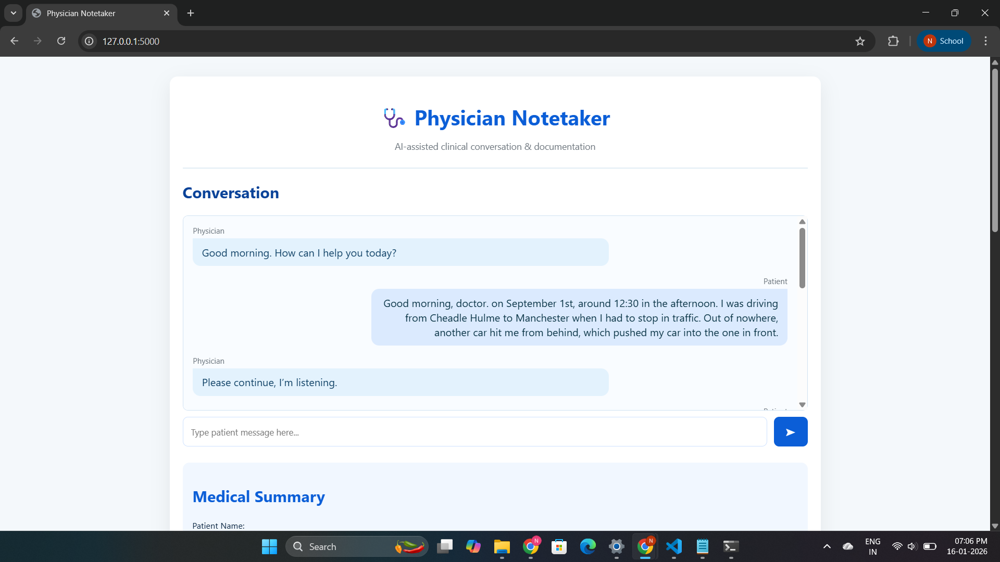
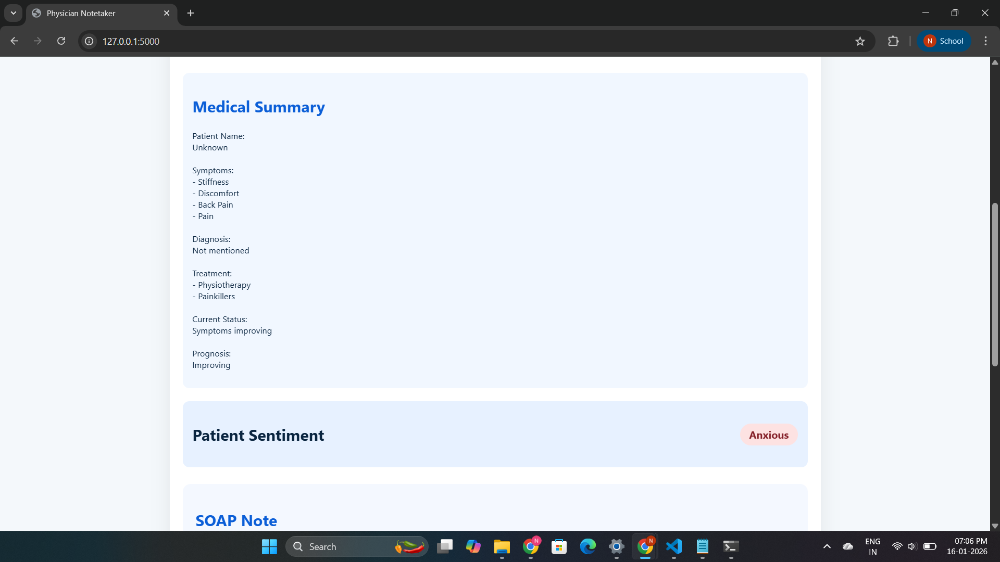
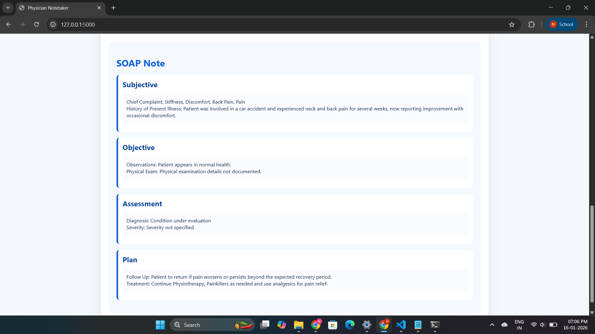
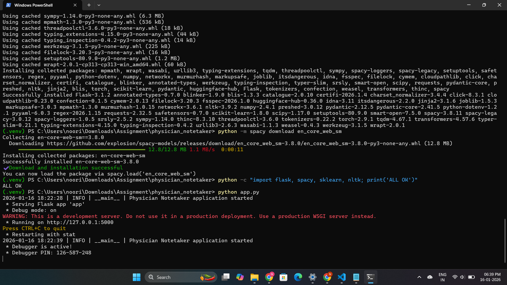

# Physician Notetaker

An AI assisted medical documentation system that captures physician patient conversations and automatically generates:

Structured medical summaries  
Patient sentiment & intent analysis  
SOAP notes (Subjective, Objective, Assessment, Plan)

Built using Flask, Python 3.13.5, and a modular NLP pipeline, this project demonstrates an end-to-end healthcare oriented AI system with clean architecture, validation, logging, testing, and a user friendly web interface.

---

## Features

Interactive physician patient chat interface  

Medical NLP pipeline:
- Named Entity Recognition (Symptoms, Diagnosis, Treatment, Prognosis)
- Keyword extraction
- Structured medical summarization  

Sentiment & Intent Analysis  
Anxious / Neutral / Reassured  

SOAP Note Generation  

Validation & error handling (healthcare-safe)  

Persistent JSON outputs  

Unit tests with pytest  

Config-driven & .env-based setup  

Clean blue–white medical UI  

---

## NLP Capabilities

### 1. Medical NLP Summarization
### 2. Sentiment & Intent Analysis
### 3. SOAP Note Generation

## Project Structure
```bash
physician_notetaker/
│
├── app.py
├── config.py
├── requirements.txt
├── README.md
│
├── templates/
│   └── index.html
│
├── static/
│   ├── css/
│   │   └── style.css
│   └── js/
│       └── chat.js
│
├── nlp/
│   ├── __init__.py
│   ├── pipeline.py
│   ├── preprocessing.py
│   ├── ner.py
│   ├── keywords.py
│   ├── summarization.py
│   ├── sentiment_intent.py
│   └── soap.py
│
├── data/
│   ├── transcripts/
│   │   └── sample_conversation.txt
│   │
│   ├── conversation_log.json
│   │
│   └── outputs/
│       ├── structured_summary.json
│       ├── sentiment_intent.json
│       └── soap_note.json
│
├── models/
│   ├── ner/
│   │   └── medical_ner_model/
│   │
│   ├── sentiment/
│   │   └── bert_sentiment_model.pt
│   │
│   └── summarization/
│       └── medical_summarizer/
│
├── utils/
│   ├── logger.py
│   ├── validators.py
│   └── evaluation.py
│
└── tests/
    ├── test_ner.py
    ├── test_sentiment.py
    ├── test_summary.py
    └── test_soap.py
```

## Requirements

Python: 3.13.5
OS: Windows / Linux / macOS

### Install dependencies
```bash
pip install -r requirements.txt
```
### spaCy setup
```bash
python -m spacy download en_core_web_sm
```
### Environment Setup

Create a .env file in the project root:
```bash
APP_NAME=Physician Notetaker
FLASK_DEBUG=True
HOST=127.0.0.1
PORT=5000
SPACY_MODEL=en_core_web_sm
```
The .env file is ignored via .gitignore for security.

### Run the Application
```bash
python app.py
```

Open in browser:
```bash
http://127.0.0.1:5000
```

Run Tests
```bash
pytest
```

All NLP components (NER, sentiment, summary, SOAP) are unit-tested.

## Screenshots






## Author:
Noorin Nasir Khot
